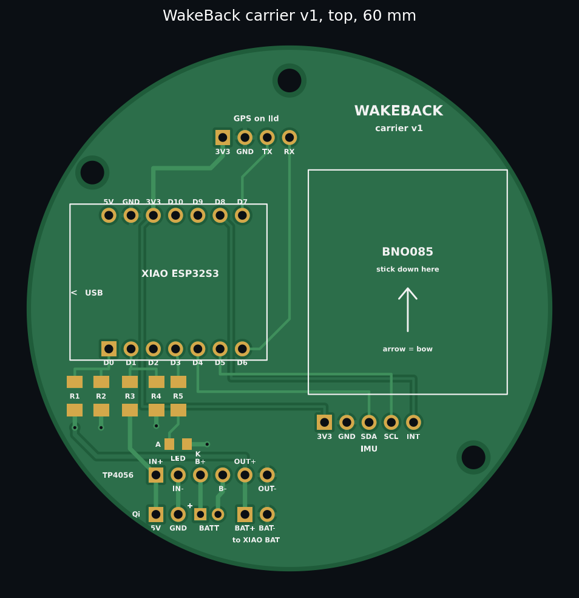

# WakeBack carrier board v1

A 60 mm round, 2-layer board that replaces the breadboard. The same modules from the shopping list in `BUILD.md` solder onto it; there's nothing new to buy apart from the resistors and LED in 1206 size.

## Ordering from JLCPCB

1. Go to jlcpcb.com, **Order now**, upload `out/wakeback-carrier-v1-gerbers.zip`.
2. Settings: 2 layers, 1.6 mm, any colour, HASL lead-free finish. Leave everything else at default. It should read 60 × 60 mm.
3. "Remove order number": pick **Yes** or **Specify a location**, otherwise JLCPCB prints their number somewhere on the silkscreen.
4. Shipping: pick the economy option, not DHL.
5. Optional but recommended: turn on **PCB Assembly** (Economic, top side) and upload `out/wakeback-carrier-v1-BOM.csv` and `out/wakeback-carrier-v1-CPL.csv`. JLCPCB then fits R1–R5 and the LED (all their "basic" parts, about £8–10 extra). In the placement preview, check the LED's cathode mark sits on the K pad.

## What goes where

**Top side**
- **XIAO ESP32S3** on its header pins, USB-C facing the board edge (marked). Tip: use two 7-pin female headers so the XIAO can come off again.
- **R1 to R4: 100 kΩ, R5: 300 or 330 Ω**, all 1206. **LED** 0805: the A pad goes toward R5, and the green mark on the LED (cathode) toward K. (Skip if JLCPCB fitted them.)
- **BNO085**: stick it inside its outline with foam tape, arrow pointing to the bow. Five short wires from its pins to the IMU pads: 3V3 → VIN, GND, SDA, SCL, INT.
- **GPS pads**: four wires up to the BE-880 on the lid (3V3, GND, TX, RX, labelled from the GPS's point of view: its TX goes to the TX pad).

**Bottom side** (the pads are labelled on both sides)
- **TP4056** module inside its outline, USB end to the edge. Six short wires: IN+, IN−, B+, B−, OUT+, OUT−.
- **Qi receiver**: 5V and GND to the Qi pads. The board itself sits next to the battery, and the coil goes under the battery against the case base.
- **Battery**: JST-PH socket; the square pad is **+**. **Check the battery's polarity with a meter first.**
- **XIAO BAT pads**: two thin wires from the BAT+ and BAT− pads on the XIAO's underside to the BAT+/BAT− pads. Solder these to the XIAO *before* fitting it.

## Check it before powering up

With a meter on continuity, nothing connected yet:
- GND to 3V3: **not** connected
- OUT+ (VSYS) to GND: **not** connected
- IN− (Qi GND) to GND: **not** connected. They're deliberately separate, because the TP4056 protection circuit sits between them.

Then fit the modules one at a time in the same order as the breadboard stages in `BUILD.md`, running the bench test after each.

## Design notes

- Pins match `firmware/bench_test`: D0 battery sense, D1 pad sense, D3 LED, D4/D5 I2C, D6/D7 GPS, D8 IMU interrupt.
- Bottom layer is a ground fill. Clearances are 0.25 mm minimum (JLCPCB allows 0.127), copper is 0.5 mm from the edge, and labels are 0.8 mm tall or more.
- Three M2.5 mounting holes.
- The board is generated by `gen_carrier.py`. Change it and run it again: it checks clearances and that every connection is joined, then rewrites the Gerbers and the previews.
