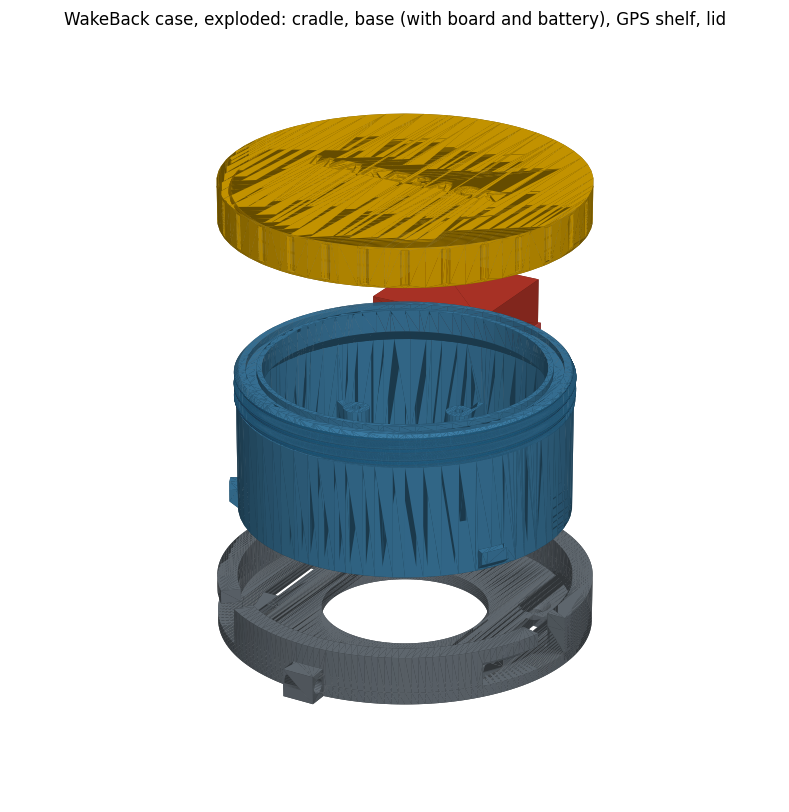
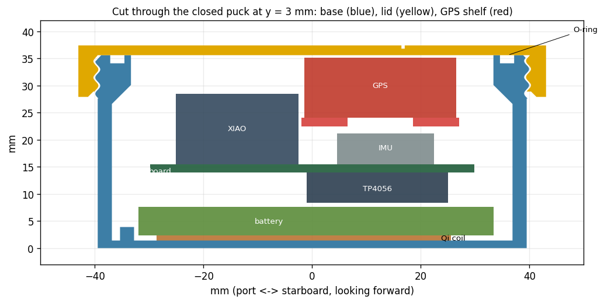

# WakeBack puck case

A round puck, 86 mm across and 37 mm tall, made to fit the carrier board and the parts on the shopping list. It has four printed parts:

| File | What it is | Print it |
|---|---|---|
| `out/wakeback-base.stl` | The cup. The battery, Qi coil, carrier board and TP4056 go inside. Bayonet lugs round the bottom | As it comes, floor down |
| `out/wakeback-lid.stl` | Screw-on lid with a thread and an O-ring seal | Top face down (the file is already that way up) |
| `out/wakeback-bridge.stl` | GPS shelf. Sits over the heel sensor on two legs | Flat side down (already that way up) |
| `out/wakeback-cradle.stl` | Deck mount. Drop the puck in and twist it clockwise to lock it | As it comes |

## Print settings

- **PETG** (easy, tough) or **ASA** (better in sun for years). Not PLA: it softens in a hot boat and creeps.
- 0.2 mm layers, **5 perimeters**, 6 top and 6 bottom layers, 40 % gyroid infill. No supports needed.
- Flow at 100–103 %. Slight over-extrusion helps it stay watertight.
- Check the lid screws on before you print the cradle. If the thread is tight, raise `THREAD_CLR` in `gen_case.py` by 0.1 and re-run it.

## Also buy

- O-ring **70 × 2 mm**, nitrile. A pack of 10 is a couple of pounds.
- M2.5 stainless screws: **2 × 20 mm** (board and GPS shelf) and **1 × 8 mm** (third board hole). Self-tapping, or plain machine screws; either cuts its own thread in the plastic.
- A 1 mm self-adhesive foam pad for the top of the GPS, and double-sided foam tape.
- A little silicone grease for the O-ring.
- For the cradle: 3 × No.6 (3.5 mm) countersunk stainless screws, or a 20 mm Velcro strap through the two slots.

## Putting it together

1. **O-ring:** grease it lightly and press it into the groove on the rim of the base.
2. **Qi coil:** stick it to the middle of the floor, coil side down (touching the floor), shield sticker side up. The thinner the gap to the pad, the better it charges.
3. **Qi receiver board:** stick it down in the gap beside the battery, on the starboard-aft side (see `case-plans.png`).
4. **Battery:** it drops in between the four corner stops, sitting on the coil. It goes in at an angle so it misses the three board posts. Tilt it to get it past the rim.
5. **Carrier board:** onto the three posts, heel-sensor arrow toward the arrow on the outside of the base. One **M2.5 × 8** screw goes in the hole by the XIAO.
6. **GPS:** stick it on the shelf with foam tape, ceramic antenna facing up. Put the shelf over the heel sensor and fix it with the two **M2.5 × 20** screws, through the shelf legs and the board into the posts. Add the 1 mm foam pad on top of the GPS.
7. **Lid:** screw it on hand-tight. It's a normal thread: clockwise closes, anticlockwise opens.

The inside heights are tight. The battery top sits 6.3 mm under the board, and the TP4056 needs 5.5 mm, so keep the wires under the board flat.

## Check it's watertight

Before any electronics go in: put a dry tissue inside, screw the lid on, and hold it under water in a sink for 30 minutes (weigh it down). The tissue should come out dry. If it's damp, look for the leak: usually a thin wall or a gap between layers. Print again with 6 perimeters, or brush the outside with a thin coat of epoxy (XTC-3D or similar).

It floats. It displaces about 196 cm³ and weighs about 130 g with everything in.

## The cradle

- Screw or strap it to the boat with its **arrow pointing at the bow**.
- Hold the puck with its side arrow about 20° anticlockwise of the cradle arrow. Push it down, then twist it clockwise until the arrows line up. It clamps down as it goes home.
- Tie a thin lanyard through the eye on the cradle to the puck, in case of a big capsize.
- To charge it, twist it out and lay it on the Qi pad, flat side down.

## Things to know

- The status LED is inside. If you want to see it, print the lid in clear or natural PETG.
- **GPS power:** Beitian lists the BE-880 at 3.6–5.5 V, and the board feeds it 3.3 V. Most of these modules run happily on 3.3 V, and Stage 2 of the bench test will show you. If it won't get a fix or keeps dropping out, move the GPS red wire from the 3V3 pad to OUT+ on the TP4056 (battery voltage).
- Everything is generated by `gen_case.py`: sizes at the top, then the parts. Run it again after any change. It checks that nothing inside hits the case, that the lid unscrews cleanly, and that the puck drops into the cradle and twists to lock. Then it rewrites the STLs and pictures. It needs `pip install manifold3d trimesh numpy matplotlib`.
